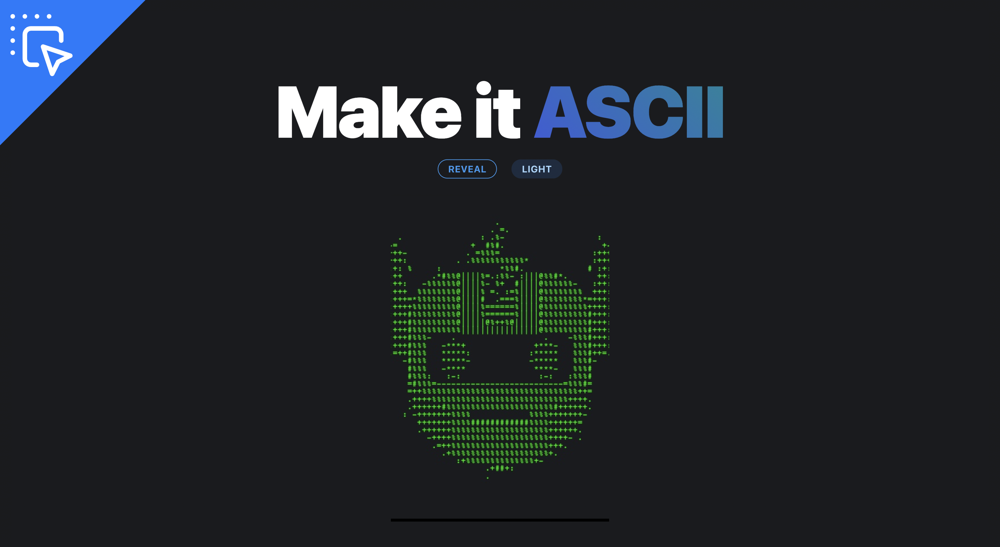
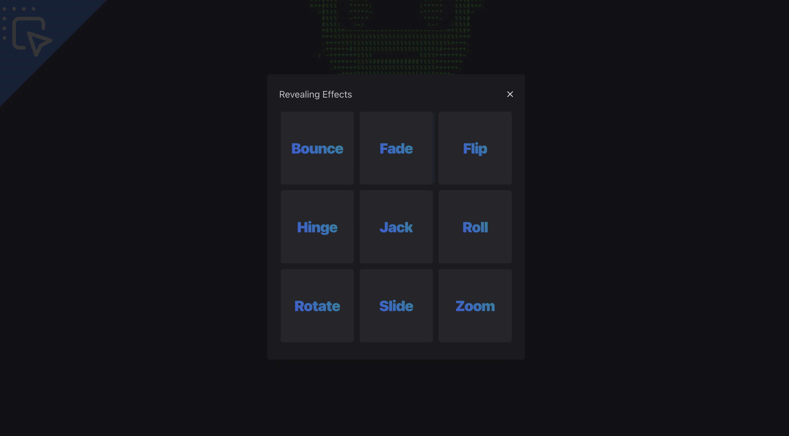
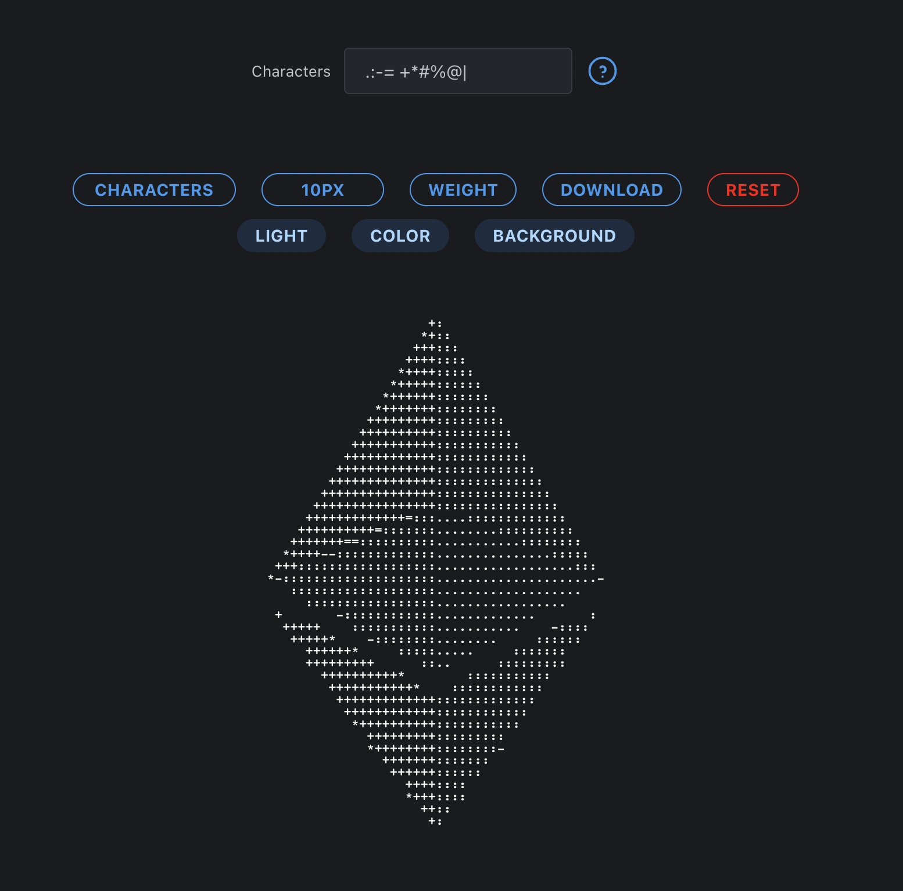
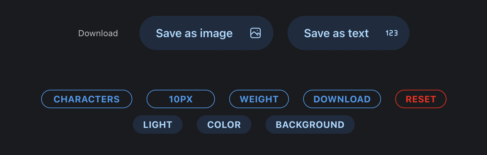

<html>
<body>
<link rel="stylesheet" href="https://cdnjs.cloudflare.com/ajax/libs/font-awesome/6.3.0/css/all.min.css" integrity="sha512-SzlrxWUlpfuzQ+pcUCosxcglQRNAq/DZjVsC0lE40xsADsfeQoEypE+enwcOiGjk/bSuGGKHEyjSoQ1zVisanQ==" crossorigin="anonymous" referrerpolicy="no-referrer" />

# Make it ASII

  

  <table style="width:100%">
    <thead>
      <tr>
        <th>Language</th>
        <th>Built With</th>
        <th>Styled With</th>
      </tr>
    </thead>
    <tbody>
      <tr>
        <td><a href="https://www.typescriptlang.org/">Typescript</a></td>
        <td><a href="https://nextjs.org/">Next.js</a></td>
        <td><a href="https://mantine.dev/">Mantine</a></td>
      </tr>
    </tbody>
  </table>

<h2 style="color:orange">About The Project</h2>

 Make it ASII is a project that I was motavated to build once I started looking into ascii art. I thought that is would be cool to be able to transform any image into ascii art. I added some customizations to the project to make it more fun. I hope you enjoy it.

<h2 style="color:orange">What I learned</h2>

  I learned that it is tricky generate ascii art with your own characters and return a desired result. I have used Mantine of multiple project now and still highly recommend it. Take a look at my <a href="https://github.com/passandscore/find-my-nft" target="_blank">Find My NFT</a> project to see how I used it there. I have been using Next.js for a while now and I am still amazed at how easy it is to get up and running with a new project. Typescript is a must for me. I love the type safety that it provides.

<h2 style="color:orange">Installation</h2>

  <strong>You will be up and running in 4 simple steps</strong>

<pre>
Step 1
git clone https://github.com/passandscore/make-it-ascii

Step 2
yarn run dev

Step 3
Open your browser and go to http://localhost:3000/

Step 4
Drag and drop an image onto the page or click the page to select an image.
</pre>

<h1 style="color:orange">Features</h1>

<strong>1. Reveal</strong>

  

<h4>Functionality</h4>

<ul style="margin-bottom:2rem">
  <li>Select from a 9 different options.</li>
  <li>Watch your downloaded image reveal itself in that selected manner.</li>
</ul>

<strong>2. Customization</strong>

  

<h4>Functionality</h4>

<ul style="margin-bottom:2rem">
  <li>Change font color.</li>
  <li>Change font weight.</li>
  <li>Change characters</li>
  <li>Change font size.</li>
  <li>Change background color.</li>
</ul>

<strong>2. Download</strong>

  

<h4>Functionality</h4>

<ul style="margin-bottom:2rem">
  <li>Save as an image.</li>
  <li>Save as text</li>
</ul>

<strong>You can find me on social media:</strong>

</body>
</html>
